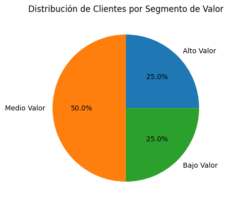
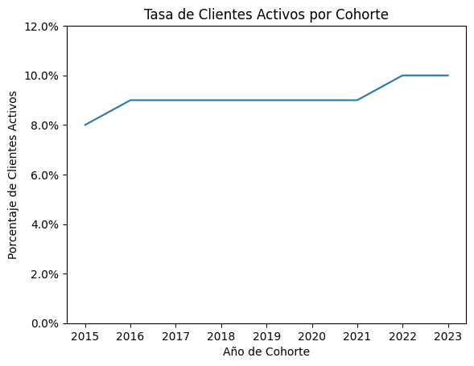
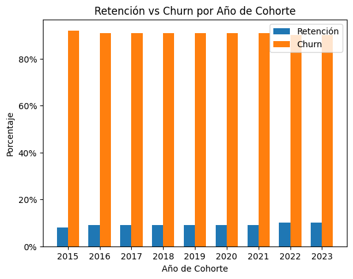

# Analisis de ventas en SQL

## Descripcion general
Este es un analisis del comportamineto del cliente, retencion del mismo y la ganancia que va dejando, para una empresa de e-commerce para mejorar la retencion de clientes y maximizar los ingresos

## 💼 Preguntas del negocio
- 1️⃣  **Segmentacion de Clientes:** Cuales son nuestros clientes mas valiosos?
- 2️⃣  **Analisis de Retencion:** Que clientes no compraron recientemente?

## Enfoque de Analisis 
### 📈 Analisis de segmentacion de clientes
- Categorizamos el cliente segun LTV (life_time_value)
- Asignamos a los clientes un valor alto, medio y bajo
- Calculamos metricas clave sobre ingresos totales

🔍 SQL Query: [1_customer_segmentation](/Scripts/1_customer_segmentation.sql)

**Grafico:**

### 📊 Claves

- El segmento de alto valor genera el 25% de los ingresos (Promedio de $10.960 USD por cliente)
- El segmento de valor medio genera el 50% de los ingresos (Promedio de $2.682 USD por cliente)
- Y el 25% restante lo genera el de bajo valor (Promedio de $347 USD por cliente)

## 📈 Analizafor de grupos (cohortes)
- Vamos a analizar seguimiento de ingresos y numeros de clientes, con la retencion de clientes.

🔍 SQL Query: [2_cohorte_analysis](/Scripts/2_cohort_analysis.sql)

**Grafico:** 

### 📊 Claves

- Las cohortes históricas muestran una tasa de clientes activos estable pero reducida, lo que indica un patrón de churn estructural en el modelo de negocio.

- Leve mejora en cohortes recientes (2022–2023)
Las cohortes más recientes presentan una retención ligeramente superior (≈10%)

- Alta concentración de clientes inactivos (~90%)
El porcentaje elevado de inactividad sugiere una oportunidad clara para implementar estrategias de reactivación y programas de fidelización.

## 📈 Retencion de clientes

🔍 SQL Query: [3_retention_analysis](/Scripts/3_retention_analysis.sql)

- Clientes identificados en riesgo de abandono
- Analizo ultimos patrones de compra (seis meses)

**Grafico:** 

### 📊 Claves

- Todas las cohortes muestran niveles de retención relativamente bajos y estables en el tiempo. Esto indica que el modelo actual presenta un patrón de desercion elevado y recurrente.

- Las cohortes más nuevas presentan una pequeña mejora en retención, lo que podría estar asociado a cambios en estrategia comercial, producto o experiencia de cliente.

## Perspectivas a mejorar

- **🎯 Potencial de campañas de reactivación:** Dado el alto volumen de clientes inactivos, existen oportunidades claras para estrategias de remarketing y fidelización.

- **⚙️ Optimización post-primera compra:** El punto crítico parece estar después de la compra inicial; intervenir en esa etapa podría reducir el churn temprano.

### Detalles tecnicos

- Base de datos: PostgreSQL
- Herramientas: PostgreSQL,DBeaver,Pgadmin
- Graficos: ChatGPT